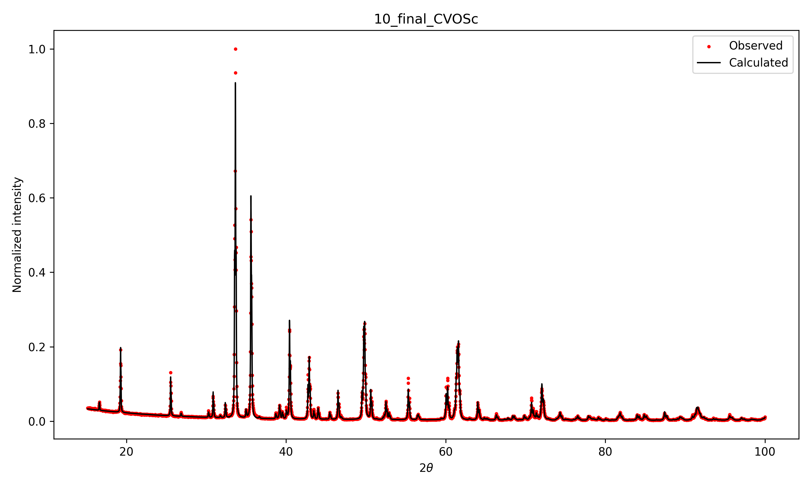

<table align="center">
<tr>
<td align="center">

<br>
Refined diffraction pattern

</td>
<td align="center">

<br>
Crystal structure with nearest bonds

</td>
</tr>
</table>


# Rietveld Refinement of a Calcium Vanadate (CVO) Diffraction Pattern

This repository contains the data, scripts, and figures used for a Rietveld refinement project performed with the **FullProf Suite** as part of a Solid State Physics course.

The goal of the project was to refine the crystal structure of a CVO sample starting from an experimental powder diffraction pattern and an initial crystallographic model provided in CIF format. The refinement was carried out step by step by progressively activating relevant parameters such as the scale factor, background polynomial, lattice parameters, and peak-profile parameters.

The repository also includes Python scripts used to generate quality plots of the diffraction pattern and zoomed views of the main peaks.

---

# Repository Structure

```
CVO_Rietveld_Refinement
│
├── data/
│   ├── CVOSc.CIF
│   └── CVOSc.DAT
│
├── evolution/
│   ├── *_refinement_step_CVOSc.XYN
│   └── *_refinement_step_CVOSc.PCR
│
├── figures/
│   ├── *_refinement_step_CVOSc.png
│   ├── Ca with O bonds.png
│   ├── V with O bonds.png
│   ├── atoms in unit cell.png
│   ├── unit cell in perspective 1.png
│   ├── unit cell in perspective 2.png
│   ├── unit cell upper view.png
│   └── zoom_peaks/
│       └── zoom_peak_near_*.png
│
├── refinement/
│   ├── CVOSc.out
│   ├── CVOSc.pcr
│   ├── CVOSc.prf
│   ├── CVOSc.sum
│   └── CVOSc.fst
│
├── report/
│   └── _(CVO)_Rietvelt_Refinement_with_FullProf.pdf
│
├── scripts/
│   ├── plot.py
│   └── plot_peaks.py
│
└── README.md
```

## Directory Description

### data/

This directory contains the original input data used to start the Rietveld refinement.

It includes:

- `.cif` file containing the initial crystallographic structure
- `.dat` file containing the experimental powder diffraction pattern

These files were provided as the starting point for the refinement and were used as inputs for the FullProf refinement procedure.


### evolution/

This directory contains intermediate files generated during the sequential refinement process.

It includes:

- `.pcr` files corresponding to each refinement stage
- `.XYN` files containing the calculated and experimental diffraction patterns at each stage

These files document the evolution of the refinement as additional parameters were activated and adjusted.


### figures/

This directory contains the figures generated for the report and repository documentation.

The figures were produced using the Python scripts located in the `scripts/` directory.

Contents include:

- normalized diffraction pattern plots showing the agreement between experimental and calculated intensities
- visualizations of the crystal structure from different orientations

A `zoom_peaks/` subdirectory is also included containing enlarged views of the five main diffraction peaks used to evaluate the quality of the refinement.


### refinement/

This directory contains the final output files generated by **FullProf** after the refinement.

Included files:

- `.pcr` – FullProf control file containing the final structural model and refinement parameters
- `.sum` – summary file containing refinement statistics
- `.out` – detailed refinement output including agreement factors
- `.prf` – calculated diffraction profile
- `.fst` – structure factor information

These files correspond to the final converged refinement.


### report/

Contains the final project report in PDF format, written in the IEEE conference paper style.


### scripts/

Contains the Python scripts used to generate the figures included in the repository and the report.

These scripts read the `.XYN` diffraction data files and produce:

- normalized comparison plots between observed and calculated intensities
- zoomed views of selected diffraction peaks

---

# Refinement Workflow

The project follows a structured workflow connecting the experimental data, 
the refinement procedure performed with FullProf, and the generation of figures 
used in the final report.

1. **Initial data**

   The refinement begins with the crystallographic model (`.cif`) and the 
   experimental diffraction pattern (`.dat`) located in the `data/` directory.

2. **Rietveld refinement**

   The refinement is performed using **FullProf**. During the process, different 
   parameters are progressively refined, including the scale factor, background 
   coefficients, zero shift, lattice parameters, and peak profile parameters.

3. **Refinement evolution**

   Intermediate stages of the refinement are stored in the `evolution/` directory.  
   Each stage includes:

   - `.pcr` files describing the refinement configuration
   - `.XYN` files containing the experimental and calculated diffraction patterns

   These files document the progression of the refinement as additional parameters 
   are introduced.

4. **Final refinement outputs**

   Once convergence is achieved, FullProf generates several output files stored in 
   the `refinement/` directory, including `.pcr`, `.out`, `.sum`, `.prf`, and `.fst`.

   These files contain the final structural parameters and the agreement factors 
   used to evaluate the quality of the refinement.

5. **Figure generation**

   The Python scripts located in the `scripts/` directory read the `.XYN` files 
   and generate normalized diffraction plots and peak zoom visualizations.  
   The resulting figures are stored in the `figures/` directory.

6. **Final report**

   The figures and refined structural parameters are used to produce the final 
   project report, which is available in the `report/` directory.

---

# Refinement Procedure

The refinement was performed using **FullProf** following a sequential strategy to ensure stability and convergence:

1. Scale factor refinement  
2. First background refinement
3. Second background refinement
4. Zero shift correction  
5. Cell parameters refinement  
6. U peak-profile parameter refinement
7. V peak-profile parameter refinement
8. W peak-profile parameter refinement
9. atomic positions correction
10. Final refinement  

The final agreement factors obtained were:

| Parameter | Value |
|-----------|-------|
| Rp | 6.60 % |
| Rwp | 8.69 % |
| Rexp | 3.22 % |
| χ² | 7.30 |

The refined lattice parameters were:

- a = 10.6754 Å  
- b = 9.2087 Å  
- c = 3.0086 Å  

---

# Generating Diffraction Plots

The Python scripts read the `.XYN` files and generate normalized diffraction plots.

### Run the main plotting script

From the repository root:

```bash
python scripts/plot.py
```

This generates normalized diffraction plots and saves them in the `figures/` directory.

### Generate zoomed views of the main peaks

```bash
python scripts/plot_peaks.py
```

This script automatically detects the strongest peaks and generates zoomed figures.

---

# Crystal Structure Visualization

The crystal structure was visualized on FullProf using the refined model. The nearest bonds were identified between:

- **V – O atoms**
- **Ca – O atoms**

---

# Requirements

The plotting scripts require the following Python packages:

- numpy  
- matplotlib  
- scipy  

Install them with:

```bash
pip install numpy matplotlib scipy
```

---

# Author

Juan Ignacio Nina

Physics Student  

Universidad San Francisco de Quito
